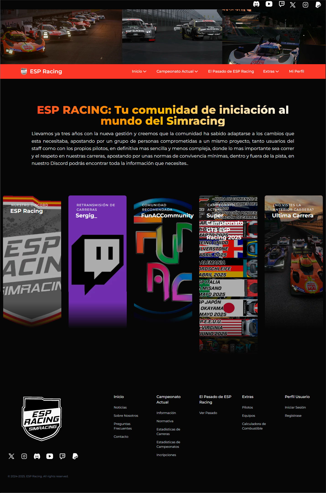

# ESP Racing: Aplicación web (Trabajo Fin de Grado)

[](LICENSE)
[](https://github.com/MrPotato1698/espracing)
[](https://github.com/MrPotato1698/espracing/commits)
[](https://espracing.vercel.app/)
[](https://github.com/MrPotato1698/espracing)
[](https://github.com/MrPotato1698/espracing)
[](https://github.com/MrPotato1698/espracing/commits)


Aplicación web de la comunidad de ESP Racing para la gestión de las carreras (inscripciones, normativas, etc.) y posteriores resultados. Además, guarda una serie de estadísticas de los pilotos que corren con la comunidad, como sus carreras disputadas, victorias, primeras posiciones, podios y demás.

> 🌍 **Aplicación desplegada:** [https://espracing.vercel.app/](https://espracing.vercel.app/)



---

## 📋 Tabla de Contenidos

- [Sobre el Proyecto](#-sobre-el-proyecto)
- [Características](#-características)
- [Tecnologías Usadas](#-tecnologías-usadas)
- [Instalación](#-instalación)
- [Uso](#-uso)
- [Licencia](#-licencia)
- [Contacto](#-contacto)

---

## 📖 Sobre el Proyecto

Este es un proyecto web para gestionar todo lo relacionado a las carreras que se realizan en la comunidad de simracing de ESP Racing, orientadas a carreras en Assetto Corsa. Esta aplicación es parte del trabajo fin de grado de los estudios realizados por mi, en el cual se quiso actualizar la web previa que existia de esta comunidad.

En esta aplicación se puede encontrar información sobre los integrantes de la administración, información sobre el campeonato que se está disputando en estos momentos, como noticias de Twitter/X o la propia normativa del campeonato, información sobre resultados de carreras o campeonatos ya disputados, con gráficas y tablas con una información super detallada de las carreras. También permite a los usuarios inscribirse en las carreras próximas, en los periodos de apertura de inscripciones con los coches adecuados.

Esta aplicación posee un sistema de autenticación de pilotos, lo que permite tener un sistema de estadísticas muy completo, según las carreras que guarde el propio sistema en su interior y esto también permite a los usuarios inscribirse a las carreras sin necesidad de introducir datos extra que compliquen la propia inscripción.

En la parte de administración, los administradores pueden controlar todo lo relacionado a los resultados de las carreras, como el control de los propios archivos de las carreras (que a la hora de subir los archivos, sufren una transformación de los datos para optimizar su tratamiento posterior y mejorar el espacio usado en el momento de guardarlos), gestión de coches, clases de coches, marcas de coches, circuitos y variantes de circuitos que se usan en las carreras, gestión de diferentes normativas a usar, gestión de los diferentes sistemas de puntuación que puedan existir y la gestión de los equipos y pilotos que pueda guardarse en el sistema de manera individual.

---

## ✨ Características

- 🏁 Vista de resultados de carreras previas.
- 🏅 Vista de clasificación de campeonatos.
- 📜 Normativa integrada.
- 🏆 Sistema de puntuaciones dinámico.
- 📅 Inscripciones a carreras, con apertura automatizadas por calendario.
- ⚙️​ Gestión sencilla de todo lo relacionado a una carrera.
- 🎨 Diseño responsivo gracias al uso de Tailwind.
- 🔒 Autenticación de usuarios con Supabase Auth.
- ⚡ Alto rendimiento gracias al uso de tecnologías como Astro o TypeScript.

---

## 🛠 Tecnologías Usadas

- **Frontend:** Astro, TailwindCSS, React (para shadcd/ui)
- **Backend / Hosting:** Supabase, Vercel
- **Lenguajes:** TypeScript, HTML5, Markdown
- **Extras:** Cron-job, ScraperAPI.

---

## 📦 Instalación

### Requisitos previos

- [Node.js](https://nodejs.org/) v22 o superior
- npm, pnpm o yarn

### Pasos

```bash
# Clonar el repositorio
git clone https://github.com/MrPotato1698/espracing.git

# Entrar en el directorio
cd espracing

# Instalar dependencias
npm install

# Iniciar en modo desarrollo
npm run dev

```

---

## 🚀 Uso

Una vez iniciado, abre tu navegador en:

```bash
http://localhost:4321
```

O visita la página actual en producción: [ESP Racing Web Application](https://espracing.vercel.app/)

---

## 📜 Licencia

Este proyecto está bajo la **Licencia GPL v3**.
Consulta el archivo [LICENSE](LICENSE) para más información.

---

## 📬 Contacto

- **Autor:** Manuel Jesús González Gutiérrez
- **GitHub:** [@MrPotato1698](https://github.com/MrPotato1698)
- **Despliegue de la aplicación:** [https://espracing.vercel.app/](https://espracing.vercel.app/)
